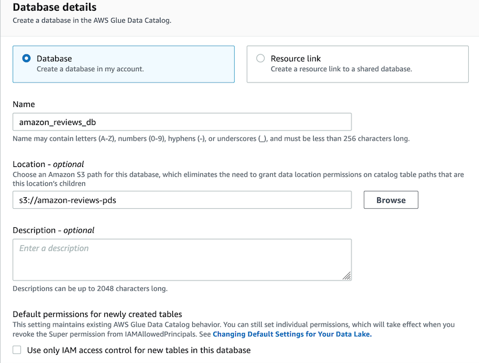
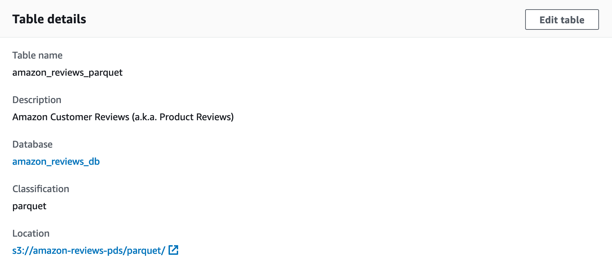

## Registering a new Database in Lake Formation

I use the [Amazon Customer Reviews Dataset](https://s3.amazonaws.com/amazon-reviews-pds/readme.html) to demonstrate how to provide granular access to the data lake for different data scientists. If you already have a dataset registered with Lake Formation that you want to use, you can skip this section and go to [Creating required IAM roles and IAM users for Data Scientists](./02_Create_IAM_Roles_And_Users.md).

To register the Amazon Customer Reviews Dataset in Lake Formation, complete the following steps:

1. Sign in to the console with the IAM user configured as Lake Formation Admin.
2. On the Lake Formation console, in the navigation pane, under **Data catalog**, choose **Databases**.
3. Choose **Create Database**.
4. In **Database details**, select **Database** to create the database in your own account.
5. For **Name**, enter a name for the database, such as `amazon_reviews_db`.
6. For Location, enter `s3://amazon-reviews-pds`.
7. Under **Default permissions for newly created tables**, make sure to clear the option **Use only IAM access control for new tables in this database**.

<p align="center">
	
</p>

8. Choose **Create database**.

The Amazon Customer Reviews Dataset is currently available in TSV and Parquet formats. The Parquet dataset is partitioned on Amazon S3 by `product_category`. To create a table in the data lake for the Parquet dataset, you can use an [AWS Glue](https://aws.amazon.com/glue) crawler or manually create the table using Athena, as described in the Amazon Customer Reviews Dataset [README file](https://s3.amazonaws.com/amazon-reviews-pds/readme.html).


9. On the Athena console, create the table.

If you haven’t specified a query result location before, follow the instructions in [Specifying a Query Result Location](https://docs.aws.amazon.com/athena/latest/ug/querying.html#query-results-specify-location).

10. Choose the data source `AwsDataCatalog`.
11. Choose the database created in the previous step.
12. In the Query Editor, enter the following query: 

```sql
CREATE EXTERNAL TABLE amazon_reviews_parquet(
	marketplace string,
	customer_id string,
	review_id string,
	product_id string,
	product_parent string,
	product_title string,
	star_rating int,
	helpful_votes int,
	total_votes int,
	vine string,
	verified_purchase string,
	review_headline string,
	review_body string,
	review_date bigint,
	year int)
PARTITIONED BY (product_category string)
ROW FORMAT SERDE
	'org.apache.hadoop.hive.ql.io.parquet.serde.ParquetHiveSerDe'
STORED AS INPUTFORMAT
	'org.apache.hadoop.hive.ql.io.parquet.MapredParquetInputFormat'
OUTPUTFORMAT
	'org.apache.hadoop.hive.ql.io.parquet.MapredParquetOutputFormat'
LOCATION
	's3://amazon-reviews-pds/parquet/'
```

13. Choose **Run query**.

You should receive a Query successful response when the table is created.

14. Enter the following query to load the table partitions: 

`MSCK REPAIR TABLE amazon_reviews_parquet`

15. Choose **Run query**.
16. On the Lake Formation console, in the navigation pane, under **Data catalog**, choose **Tables**.
17. For **Table name**, enter a table name.
18. Verify that you can see the table details.

<p align="center">
	
</p>

19. Scroll down to see the table schema and partitions.

Finally, you register the database location with Lake Formation so the service can start enforcing data permissions on the database.

20. On the Lake Formation console, in the navigation pane, under **Register and ingest**, choose **Data lake locations**.
21. On the **Data lake locations** page, choose **Register location**.
22. For **Amazon S3 path**, enter `s3://amazon-reviews-pds/`.
23. For **IAM role**, you can keep the default role.
24. Choose **Register location**.

## [Proceed to the next section](./02_Create_IAM_Roles_And_Users.md) to create the required IAM roles and users for data scientists.

