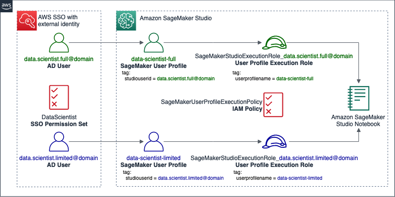
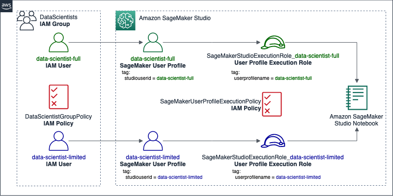

## Creating required IAM resources

To demonstrate how you can provide differentiated access to the dataset registered in the previous step, you first need to create IAM policies, roles, and, if using AWS IAM users for authentication, a group, and users. The implementation leverages [attribute-based access control](https://docs.aws.amazon.com/IAM/latest/UserGuide/introduction_attribute-based-access-control.html) (ABAC) to define IAM permissions.

### IAM resources for authentication using federation

The following diagram illustrates the resources you configure in this section if using federated identities with AWS SSO (aligned with our [best practice](https://wa.aws.amazon.com/wat.question.SEC_2.en.html) of using temporary credentials to access AWS accounts).

    

In this section, you complete the following high-level steps for users authenticated into AWS SSO, assuming the users are utilizing their Microsoft Active Directory (AD) email credentials:

1. Create an SSO permission set named `DataScientist` and assign SSO access into your AWS account to the users: `data-scientist-full@domain` and `data-scientist-limited@domain`, to control their federated access to the console and to Studio. 
2. Add a custom inline policy to SSO permission set. 

The policy allows users in the group to access Studio, but only using a SageMaker user profile with a tag that matches their AD user name. The AD user name can be sent as an attribute from an external identity provider into AWS SSO, and then [used for access control](https://docs.aws.amazon.com/singlesignon/latest/userguide/attributesforaccesscontrol.html). The policy also denies the use of SageMaker notebook instances, allowing Studio notebooks only.

3. For each AD user, create individual IAM roles, which are used as user profile execution roles in Studio later. 

The naming convention for these roles consists of a common prefix followed by the corresponding AD user name. This allows you to audit activities on Studio notebooks—which are logged using Studio’s execution roles—and trace them back to the individual users who performed the activities. For this post, I use the prefix `SageMakerStudioExecutionRole_`.

4. Create a managed policy named `SageMakerUserProfileExecutionPolicy` and assign it to each of the IAM roles. 

The policy establishes coarse-grained access permissions to the data lake.

### IAM resources for authentication using AWS IAM

The following diagram illustrates the resources you configure in this section if using AWS IAM users for authentication.

    

In this section, you complete the following high-level steps:

1. Create an IAM group named `DataScientists` containing two users: `data-scientist-full` and `data-scientist-limited`, to control their access to the console and to Studio. 
2. Create a managed policy named `DataScientistGroupPolicy` and assign it to the group. 

The policy allows users in the group to access Studio, but only using a SageMaker user profile with a tag that matches their IAM user name. It also denies the use of SageMaker notebook instances, allowing Studio notebooks only.

3. For each IAM user, create individual IAM roles, which are used as user profile execution roles in Studio later. 

The naming convention for these roles consists of a common prefix followed by the corresponding IAM user name. This allows you to audit activities on Studio notebooks—which are logged using Studio’s execution roles—and trace them back to the individual IAM users who performed the activities. For this post, I use the prefix `SageMakerStudioExecutionRole_`.

4. Create a managed policy named `SageMakerUserProfileExecutionPolicy` and assign it to each of the IAM roles. 

The policy establishes coarse-grained access permissions to the data lake.

Follow the remainder of this section to create the IAM resources described, depending on whether you use federated identities with AWS SSO (aligned with our [best practice](https://wa.aws.amazon.com/wat.question.SEC_2.en.html) of using temporary credentials to access AWS accounts) or AWS IAM users. The permissions configured in this section grant common, coarse-grained access to data lake resources for all the IAM roles. In a later section, you use Lake Formation to establish fine-grained access permissions to Data Catalog resources and Amazon S3 locations for individual roles.

### Creating the required SSO permission set (only for authentication using federation)

To create your SSO permission set and assign it to your data scientists, complete the following steps:

1. Sign in to the console using an IAM principal with permissions to create SSO permission sets and assign SSO access to users and groups into your AWS account. 
2. (If using AWS Managed Microsoft AD directory) On the AWS SSO console, verify that the AWS SSO user attribute `email` [is mapped](https://docs.aws.amazon.com/singlesignon/latest/userguide/mapssoattributestocdattributes.html) to the attribute `${dir:windowsUpn}` in Active Directory.
3. On the SSO console, [enable attributes for access control](https://docs.aws.amazon.com/singlesignon/latest/userguide/configure-abac.html) and select the mapped attribute.
	- On the **Attributes for access control** page, in the **Key** field, enter `studiouserid`.
	- In the **Value (optional)** field, choose or enter `${user:email}`.
4. [Create a custom permission set](https://docs.aws.amazon.com/singlesignon/latest/userguide/howtocreatepermissionset.html) named `DataScientist`, based on custom permissions. 
	- Under **Create a custom permissions policy**, use the following JSON policy document to provide permissions:

        <pre class=" language-json">
		{
			"Version": "2012-10-17",
			"Statement": [
				{
					"Action": [
						"sagemaker:DescribeDomain",
						"sagemaker:ListDomains",
						"sagemaker:ListUserProfiles",
						"sagemaker:ListApps"
					],
					"Resource": "*",
					"Effect": "Allow",
					"Sid": "AmazonSageMakerStudioReadOnly"
				},
				{
					"Action": "sagemaker:AddTags",
					"Resource": "*",
					"Effect": "Allow",
					"Sid": "AmazonSageMakerAddTags"
				},
				{
					"Condition": {
						"StringEquals": {
							"sagemaker:ResourceTag/studiouserid": "${aws:PrincipalTag/studiouserid}"
						}
					},
					"Action": [
						"sagemaker:CreatePresignedDomainUrl",
						"sagemaker:DescribeUserProfile"
					],
					"Resource": "*",
					"Effect": "Allow",
					"Sid": "AmazonSageMakerAllowedUserProfile"
				},
				{
					"Condition": {
						"StringNotEquals": {
							"sagemaker:ResourceTag/studiouserid": "${aws:PrincipalTag/studiouserid}"
						}
					},
					"Action": [
						"sagemaker:CreatePresignedDomainUrl",
						"sagemaker:DescribeUserProfile"
					],
					"Resource": "*",
					"Effect": "Deny",
					"Sid": "AmazonSageMakerDeniedUserProfiles"
				},
				{
					"Action": [
						"sagemaker:CreatePresignedNotebookInstanceUrl",
						"sagemaker:*NotebookInstance",
						"sagemaker:*NotebookInstanceLifecycleConfig",
						"sagemaker:CreateUserProfile",
						"sagemaker:DeleteDomain",
						"sagemaker:DeleteUserProfile"
					],
					"Resource": "*",
					"Effect": "Deny",
					"Sid": "AmazonSageMakerDeniedServices"
				}
			]
		}
        </pre>

The policy allows users to access Studio, but only using a SageMaker user profile with a tag that matches their AD user name. It also denies the use of SageMaker notebook instances, allowing Studio notebooks only.

5. [Assign SSO access](https://docs.aws.amazon.com/singlesignon/latest/userguide/useraccess.html) into your AWS account to a group containing the data scientist users.
	- In the **Select users or groups** page, type a group name containing the data scientist users in your connected directory.
	- In the **Select permission sets** page, select the `DataScientist` permission set.

### Creating the required IAM group and users (only for authentication using AWS IAM):

To create your group and users, complete the following steps:

1. Sign in to the console using an IAM user with permissions to create groups, users, roles, and policies.
2. On the IAM console, [create policies on the JSON tab](https://docs.aws.amazon.com/IAM/latest/UserGuide/access_policies_create-console.html#access_policies_create-json-editor) to create a new IAM managed policy named `DataScientistGroupPolicy`.
    - Use the following JSON policy document to provide permissions:

        <pre class=" language-json">
		{
			"Version": "2012-10-17",
			"Statement": [
				{
					"Action": [
						"sagemaker:DescribeDomain",
						"sagemaker:ListDomains",
						"sagemaker:ListUserProfiles",
						"sagemaker:ListApps"
					],
					"Resource": "*",
					"Effect": "Allow",
					"Sid": "AmazonSageMakerStudioReadOnly"
				},
				{
					"Action": "sagemaker:AddTags",
					"Resource": "*",
					"Effect": "Allow",
					"Sid": "AmazonSageMakerAddTags"
				},
				{
					"Condition": {
						"StringEquals": {
							"sagemaker:ResourceTag/studiouserid": "${aws:username}"
						}
					},
					"Action": [
						"sagemaker:CreatePresignedDomainUrl",
						"sagemaker:DescribeUserProfile"
					],
					"Resource": "*",
					"Effect": "Allow",
					"Sid": "AmazonSageMakerAllowedUserProfile"
				},
				{
					"Condition": {
						"StringNotEquals": {
							"sagemaker:ResourceTag/studiouserid": "${aws:username}"
						}
					},
					"Action": [
						"sagemaker:CreatePresignedDomainUrl",
						"sagemaker:DescribeUserProfile"
					],
					"Resource": "*",
					"Effect": "Deny",
					"Sid": "AmazonSageMakerDeniedUserProfiles"
				},
				{
					"Action": [
						"sagemaker:CreatePresignedNotebookInstanceUrl",
						"sagemaker:*NotebookInstance",
						"sagemaker:*NotebookInstanceLifecycleConfig",
						"sagemaker:CreateUserProfile",
						"sagemaker:DeleteDomain",
						"sagemaker:DeleteUserProfile"
					],
					"Resource": "*",
					"Effect": "Deny",
					"Sid": "AmazonSageMakerDeniedServices"
				}
			]
		}
        </pre>

The policy allows users in the group to access Studio, but only using a SageMaker user profile with a tag that matches their IAM user name. It also denies the use of SageMaker notebook instances, allowing Studio notebooks only.

1. [Create an IAM group](https://docs.aws.amazon.com/IAM/latest/UserGuide/id_groups_create.html).
    - For **Group name**, enter `DataScientists`.
    - Search and attach the AWS managed policy named `DataScientist` and the IAM policy created in the previous step.

2. [Create two IAM users](https://docs.aws.amazon.com/IAM/latest/UserGuide/id_users_create.html#id_users_create_console) named `data-scientist-full` and `data-scientist-limited`.

Alternatively, you can provide names of your choice, as long as they’re a combination of lowercase letters, numbers, and hyphen (-). Later, you also give these names to their corresponding SageMaker user profiles, which at the time of writing [only support those characters](https://docs.aws.amazon.com/sagemaker/latest/APIReference/API_CreateUserProfile.html#sagemaker-CreateUserProfile-request-UserProfileName).

### Creating the required IAM roles:

To create your roles, complete the following steps:

1. On the IAM console, [create a new managed policy](https://docs.aws.amazon.com/IAM/latest/UserGuide/access_policies_create-console.html#access_policies_create-json-editor) named `SageMakerUserProfileExecutionPolicy`. 
    - Use the following JSON policy document to provide permissions, providing your AWS Region and AWS account ID:

        <pre class=" language-json">
		{
			"Version": "2012-10-17",
			"Statement": [
				{
					"Action": [
						"sagemaker:DescribeDomain",
						"sagemaker:ListDomains",
						"sagemaker:ListUserProfiles",
						"sagemaker:ListApps"
					],
					"Resource": "*",
					"Effect": "Allow",
					"Sid": "AmazonSageMakerStudioReadOnly"
				},
				{
					"Action": "sagemaker:AddTags",
					"Resource": "*",
					"Effect": "Allow",
					"Sid": "AmazonSageMakerAddTags"
				},
				{
					"Action": "sagemaker:DescribeUserProfile",
					"Resource": "arn:aws:sagemaker:<em>&lt;aws region&gt;</em>:<em>&lt;account id&gt;</em>:user-profile/*/${aws:PrincipalTag/userprofilename}",
					"Effect": "Allow",
					"Sid": "AmazonSageMakerAllowedUserProfile"
				},
				{
					"Action": "sagemaker:DescribeUserProfile",
					"Effect": "Deny",
					"NotResource": "arn:aws:sagemaker:<em>&lt;aws region&gt;</em>:<em>&lt;account id&gt;</em>:user-profile/*/${aws:PrincipalTag/userprofilename}",
					"Sid": "AmazonSageMakerDeniedUserProfiles"
				},
				{
					"Action": "sagemaker:*App",
					"Resource": "arn:aws:sagemaker:<em>&lt;aws region&gt;</em>:<em>&lt;account id&gt;</em>:app/*/${aws:PrincipalTag/userprofilename}/*",
					"Effect": "Allow",
					"Sid": "AmazonSageMakerAllowedApp"
				},
				{
					"Action": "sagemaker:*App",
					"Effect": "Deny",
					"NotResource": "arn:aws:sagemaker:<em>&lt;aws region&gt;</em>:<em>&lt;account id&gt;</em>:app/*/${aws:PrincipalTag/userprofilename}/*",
					"Sid": "AmazonSageMakerDeniedApps"
				},
				{
					"Action": [
						"lakeformation:GetDataAccess",
						"glue:GetTable",
						"glue:GetTables",
						"glue:SearchTables",
						"glue:GetDatabase",
						"glue:GetDatabases",
						"glue:GetPartitions"
					],
					"Resource": "*",
					"Effect": "Allow",
					"Sid": "LakeFormationPermissions"
				},
				{
					"Effect": "Allow",
					"Action": [
						"s3:CreateBucket",
						"s3:GetObject",
						"s3:PutObject"
					],
					"Resource": [
						"arn:aws:s3:::sagemaker-audit-control-query-results-<em>&lt;aws region&gt;</em>-<em>&lt;account id&gt;</em>",
						"arn:aws:s3:::sagemaker-audit-control-query-results-<em>&lt;aws region&gt;</em>-<em>&lt;account id&gt;</em>/*"
					]
				},
				{
					"Action": "iam:PassRole",
					"Resource": "*",
					"Effect": "Allow",
					"Sid": "AmazonSageMakerStudioIAMPassRole"
				},
				{
					"Action": "sts:AssumeRole",
					"Resource": "*",
					"Effect": "Deny",
					"Sid": "DenyAssummingOtherIAMRoles"
				}
			]
		} 
        </pre>

This policy provides limited IAM permissions to Studio. For more information on recommended policies for team groups in Studio, see [Configuring Amazon SageMaker Studio for teams and groups with complete resource isolation](https://aws.amazon.com/blogs/machine-learning/configuring-amazon-sagemaker-studio-for-teams-and-groups-with-complete-resource-isolation/). The policy also provides common coarse-grained IAM permissions to the data lake, leaving Lake Formation permissions to control access to Data Catalog resources and Amazon S3 locations for individual users and roles. This is the recommended method for granting access to data in Lake Formation. For more information, see [Methods for Fine-Grained Access Control](https://docs.aws.amazon.com/lake-formation/latest/dg/access-control-fine-grained.html).

2. [Create an IAM role](https://docs.aws.amazon.com/glue/latest/dg/create-an-iam-role-sagemaker-notebook.html) for the first data scientist (`data-scientist-full`), which is used as the corresponding user profile’s execution role. 
    - On the **Attach permissions policy** page, the AWS managed policy `AmazonSageMakerFullAccess` is attached by default. You remove this policy later, to maintain minimum privilege.
    - For **Tags**, add the key `userprofilename` and the value `data-scientist-full`.
    - For **Role name**, use the naming convention introduced at the beginning of this section to name the role `SageMakerStudioExecutionRole_data-scientist-full`.
3. To add the remaining policies, on the **Roles** page, choose the role name you just created. 
4. Under **Permissions**, remove the policy `AmazonSageMakerFullAccess`.
5. Choose **Attach policies**.
6. Search and select the `SageMakerUserProfileExecutionPolicy` and `AmazonAthenaFullAccess` policies
7. Choose **Attach policy**.
8. Repeat the previous steps to create an IAM role for the second data scientist (`data-scientist-limited`). 
   - For **Tags**, add the key `userprofilename` and the value `data-scientist-limited`.
   - For **Role name**, use the naming convention, such as `SageMakerStudioExecutionRole_data-scientist-limited`.

## [Proceed to the next section](./03_Grant_Permissions_With_Lake_Formation.md) to grant data permissions with Lake Formation.

