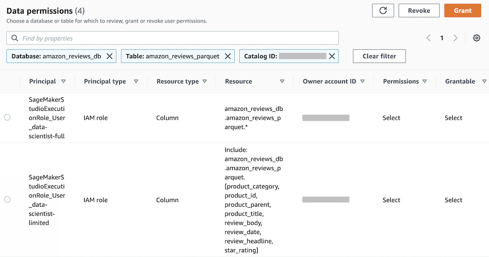

## Granting data permissions with Lake Formation

Before data scientists are able to work on a Studio notebook, you grant the individual execution roles created in the previous section access to the Amazon Customer Reviews Dataset (or your own dataset). For this post, we implement different data permission policies for each data scientist to demonstrate how to grant granular access using Lake Formation.

1. Sign in to the console with the credentials associated to a [Lake Formation administrator](https://docs.aws.amazon.com/lake-formation/latest/dg/how-it-works.html#terminology-admin), based on your authentication method (AWS IAM, AWS SSO, or federation with an external IdP).
2. On the Lake Formation console, in the navigation pane, choose **Tables**.
3. On the **Tables** page, select the table you created earlier, such as `amazon_reviews_parquet`.
4. On the **Actions** menu, under **Permissions**, choose **Grant**.
5. Provide the following information to grant full access to the Amazon Customer Reviews Dataset table for the first data scientist:
	- Select **My account**.
	- For **IAM users and roles**, choose the execution role associated to the first data scientist, such as `SageMakerStudioExecutionRole_data-scientist-full`.
	- For **Table permissions** and **Grantable permissions**, select **Select**.
	- Choose **Grant**.
6.  Repeat the first step to grant limited access to the dataset for the second data scientist, providing the following information:
	- Select **My account**.
	- For **IAM users and roles**, choose the execution role associated to the second data scientist, such as `SageMakerStudioExecutionRole_data-scientist-limited`.
	- For **Columns**, choose **Include columns**.
	- Choose a subset of columns, such as: `product_category`, `product_id`, `product_parent`, `product_title`, `star_rating`, `review_headline`, `review_body`, and `review_date`.
	- For **Table permissions** and **Grantable permissions**, select **Select**.
	- Choose **Grant**.
7.  To verify the data permissions you have granted, on the Lake Formation console, in the navigation pane, choose **Tables**.
8.  On the **Tables** page, select the table you created earlier, such as `amazon_reviews_parquet`.
9.  On the **Actions** menu, under **Permissions**, choose **View permissions** to open the **Data permissions** menu.

You see a list of permissions granted for the table, including the permissions you just granted and permissions for the Lake Formation Admin.

	

If you see the principal `IAMAllowedPrincipals` listed on the **Data permissions** menu for the table, you must remove it. Select the principal and choose **Revoke**. On the **Revoke permissions page**, choose **Revoke**.

## [Proceed to the next section](./04_Set_Up_SageMaker_Studio.md) to set up SageMaker Studio.

