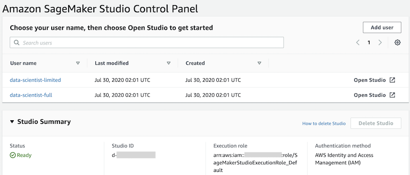

## Setting up SageMaker Studio

You now onboard to Studio and create two user profiles, one for each data scientist.

When you onboard to Studio using IAM authentication, Studio creates a domain for your account. A domain consists of a list of authorized users, configuration settings, and an Amazon EFS volume, which contains data for the users, including notebooks, resources, and artifacts.

Each user receives a private home directory within Amazon EFS for notebooks, Git repositories, and data files. All traffic between the domain and the Amazon EFS volume is communicated through specified subnet IDs. By default, all other traffic goes over the internet through a SageMaker system [Amazon Virtual Private Cloud](https://aws.amazon.com/vpc/) (Amazon VPC).

Alternatively, instead of using the default SageMaker internet access, you could secure how Studio accesses resources by assigning a private VPC to the domain. This is beyond the scope of this post, but you can find additional details in [Securing Amazon SageMaker Studio connectivity using a private VPC](https://aws.amazon.com/blogs/machine-learning/securing-amazon-sagemaker-studio-connectivity-using-a-private-vpc/).

To create the Studio user profiles with the `studiouserid` tag, I use the AWS CLI. As of this writing, including a tag when creating a user profile is available only through AWS CLI. You can find additional details in [Configuring Amazon SageMaker Studio for teams and groups with complete resource isolation](https://aws.amazon.com/blogs/machine-learning/configuring-amazon-sagemaker-studio-for-teams-and-groups-with-complete-resource-isolation/).

If you already have a Studio domain running, you can skip the onboarding process and follow the steps to create the SageMaker user profiles.

### Onboarding to Studio:

To onboard to Studio, complete the following steps:

1. Sign in to the console with the credentials of a user with service administrator permissions for SageMaker, based on your authentication method (AWS IAM, AWS SSO, or federation with an external IdP).
2. On the SageMaker console, in the navigation pane, choose **Amazon SageMaker Studio**.
3. On the **Studio** menu, under **Get started**, choose **Standard setup**.
4. For **Authentication method**, choose **AWS Identity and Access Management (IAM)**.
5. Under **Permission**, for **Execution role for all users**, choose an option from the role selector.

You’re not using this execution role for the SageMaker user profiles that you create later. If you choose **Create a new role**, the **Create an IAM role** dialog opens.

6. For **S3 buckets you specify**, choose **None**.
7. Choose **Create role**.

SageMaker creates a new IAM role named `AmazonSageMaker-ExecutionPolicy`, with the `AmazonSageMakerFullAccess` policy attached.

8. Under **Network and storage**, for **VPC**, choose the private VPC that is used for communication with the Amazon EFS volume.
9. For **Subnet(s)**, choose multiple subnets in the VPC from different Availability Zones.
10. Choose **Submit**.
11. On the **Studio Control Panel**, under **Studio Summary**, wait for the status to change to `Ready` and the **Add user button** to be enabled.

###  Creating the SageMaker user profiles:

To create your SageMaker user profiles with the `studiouserid` tag, complete the following steps:

1. On AWS CLI, create the Studio user profile for the first data scientist. Enter the following command, providing the account ID, Studio domain ID, and the identity (AWS SSO, external IdP, or AWS IAM) of the first data scientist, depending on your authentication method

	<code>
	aws sagemaker create-user-profile --domain-id <em>&lt;domain id&gt;</em> --user-profile-name data-scientist-full --tags Key=studiouserid,Value=<em>&lt;user id&gt;</em> --user-settings ExecutionRole= arn:aws:iam::<em>&lt;account id&gt;</em>:role/SageMakerStudioExecutionRole_data-scientist-full
	</code>

2. After creating the first user profile, repeat the previous step to create a second user profile on AWS CLI, providing the account ID, Studio domain ID, and the identity (AWS SSO, external IdP, or AWS IAM) of the second data scientist, depending on your authentication method

	<code>
	aws sagemaker create-user-profile --domain-id <em>&lt;domain id&gt;</em> --user-profile-name data-scientist-limited --tags Key=studiouserid,Value=<em>&lt;user id&gt;</em> --user-settings ExecutionRole=arn:aws:iam::<em>&lt;account id&gt;</em>:role/SageMakerStudioExecutionRole_data-scientist-limited
	</code>

	

## [Proceed to the next section](./05_Test_Lake_Formation_Access_Control_Policies.md) to test Lake Formation access control policies.

