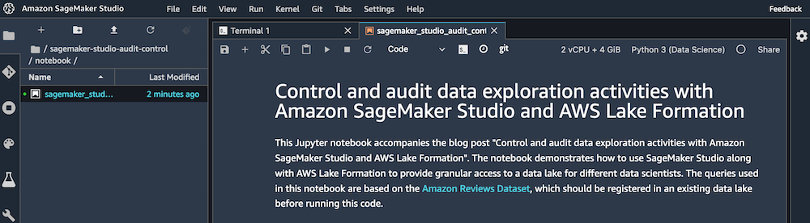
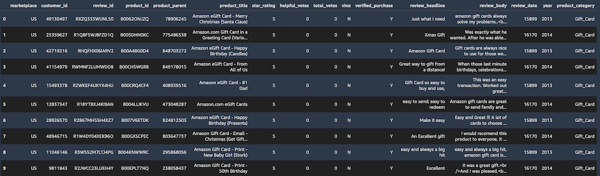
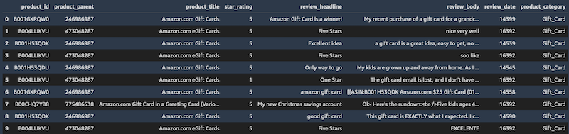

## Testing Lake Formation access control policies

You now test the implemented Lake Formation access control policies by opening Studio using both user profiles. For each user profile, you run the same Studio notebook containing Athena queries. You should see different query outputs for each user profile, matching the data permissions implemented earlier.

1. Sign in to the console with IAM user `data-scientist-full`.
2. On the SageMaker console, in the navigation pane, choose **Amazon SageMaker Studio**.
3. On the **Studio Control Panel**, choose user name `data-scientist-full`.
4. Choose **Open Studio**.
5. Wait for SageMaker Studio to load.

Due to the IAM policies attached to the IAM user, you can only open Studio with a user profile matching the IAM user name.

6. In Studio, on the top menu, under **File**, under **New**, choose **Terminal**.
7. At the command prompt, run the following command to import a sample notebook to test Lake Formation data permissions: 

	`git clone https://github.com/aws-samples/amazon-sagemaker-studio-audit.git`

8. In the left sidebar, choose the file browser icon.
9. Navigate to `amazon-sagemaker-studio-audit`.
10. Open the `notebook` folder.
11. Choose `sagemaker-studio-audit-control.ipynb` to open the notebook.
12. In the **Select Kernel** dialog, choose **Python 3 (Data Science)**.
13. Choose **Select**.
14. Wait for the kernel to load.

	

15. Starting from the first code cell in the notebook, press Shift + Enter to run the code cell.
16. Continue running all the code cells, waiting for the previous cell to finish before running the following cell.

After running the last `SELECT` query, because the user has full SELECT permissions for the table, the query output includes all the columns in the `amazon_reviews_parquet` table.

	

17. On the top menu, under **File**, choose **Shut Down**.
18. Choose **Shutdown All** to shut down all the Studio apps.
19. Close the Studio browser tab.
20. Repeat the previous steps in this section, this time signing in as the user `data-scientist-limited` and opening Studio with this user.
21. Don’t run the code cell in the section **Create S3 bucket for query output files**.

For this user, after running the same `SELECT` query in the Studio notebook, the query output only includes a subset of columns for the `amazon_reviews_parquet` table.

	

## [Proceed to the next section](./06_Audit_Data_Access_With_Lake_Formation_And_CloudTrail.md) to audit data access activity with Lake Formation and CloudTrail.

