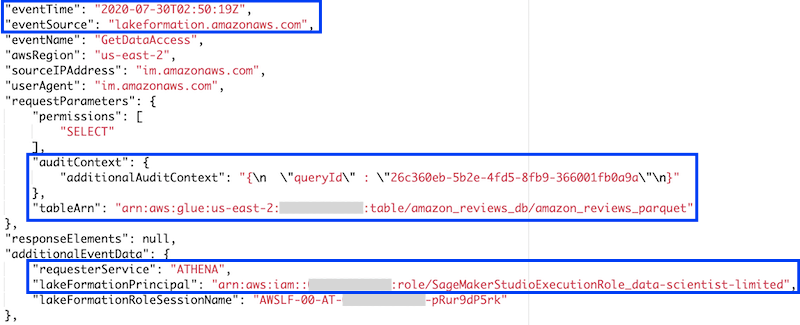
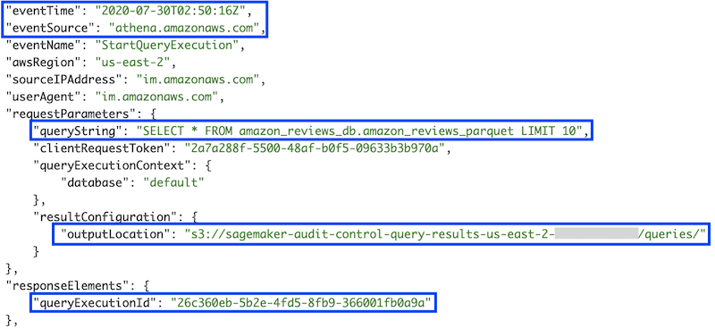

## Auditing data access activity with Lake Formation and CloudTrail

In this section, we explore the events associated to the queries performed in the previous section. The Lake Formation console includes a dashboard where it centralizes all CloudTrail logs specific to the service, such as `GetDataAccess`. These events can be correlated with other CloudTrail events, such as Athena query requests, to get a complete view of the queries users are running on the data lake.

Alternatively, instead of filtering individual events in Lake Formation and CloudTrail, you could run SQL queries to correlate CloudTrail logs using Athena. Such integration is beyond the scope of this post, but you can find additional details in [Using the CloudTrail Console to Create an Athena Table for CloudTrail Logs](https://docs.aws.amazon.com/athena/latest/ug/cloudtrail-logs.html#create-cloudtrail-table-ct) and [Analyze Security, Compliance, and Operational Activity Using AWS CloudTrail and Amazon Athena](https://aws.amazon.com/blogs/big-data/aws-cloudtrail-and-amazon-athena-dive-deep-to-analyze-security-compliance-and-operational-activity/).

### Auditing data access activity with Lake Formation

To review activity in Lake Formation, complete the following steps:

1. Sign out of the AWS account.
2. Sign in to the console with the IAM user configured as Lake Formation Admin.
3. On the Lake Formation console, in the navigation pane, choose **Dashboard**.

Under **Recent access activity**, you can find the events associated to the data access for both users.

4. Choose the most recent event with event name `GetDataAccess`.
5. Choose **View event**.

Among other attributes, each event includes the following:

- Event date and time
- Event source (Lake Formation)
- Athena query ID
- Table being queried
- IAM user embedded in the Lake Formation principal, based on the chosen role name convention

	

### Auditing data access activity with CloudTrail

To review activity in CloudTrail, complete the following steps:

1. On the CloudTrail console, in the navigation pane, choose **Event history**.
2. In the **Event history** menu, for **Filter**, choose **Event name**.
3. Enter `StartQueryExecution`.
4. Expand the most recent event, then choose **View event**.

This event includes additional parameters that are useful to complete the audit analysis, such as the following:

- Event source (Athena).
- Athena query ID, matching the query ID from Lake Formation’s `GetDataAccess` event.
- Query string.
- Output location. The query output is stored in CSV format in this Amazon S3 location. Files for each query are named using the query ID.

	

## Cleaning up

To avoid incurring future charges, delete the resources created during this walkthrough.

If you followed this walkthrough using the CloudFormation template, after shutting down the Studio apps for each user profile, deleting the stack deletes the remaining resources.

If you encounter any errors, open the Studio Control Panel and verify that all the apps for every user profile are in `Deleted` state before deleting the stack.

If you didn’t use the CloudFormation template, you can manually delete the resources you created:

1. On the **Studio Control Panel**, for each user profile, choose **User Details**.
2. Choose **Delete user**.
3. When all users are deleted, choose **Delete Studio**.
4. On the Amazon EFS console, delete the volume that was automatically created for Studio.
5. On the Lake Formation console, delete the table and the database created for the Amazon Customer Reviews Dataset.
6. Remove the data lake location for the dataset.
7. On the IAM console, delete the IAM users, group, and roles created for this walkthrough.
8. Delete the policies you created for these principals.
9. On the Amazon S3 console, empty and delete the bucket created for storing Athena query results (starting with `sagemaker-audit-control-query-results-`), and the bucket created by Studio to share notebooks (starting with `sagemaker-studio-`).

## This concludes the walkthrough. [Click here](./README.md) to go back to the main page.

