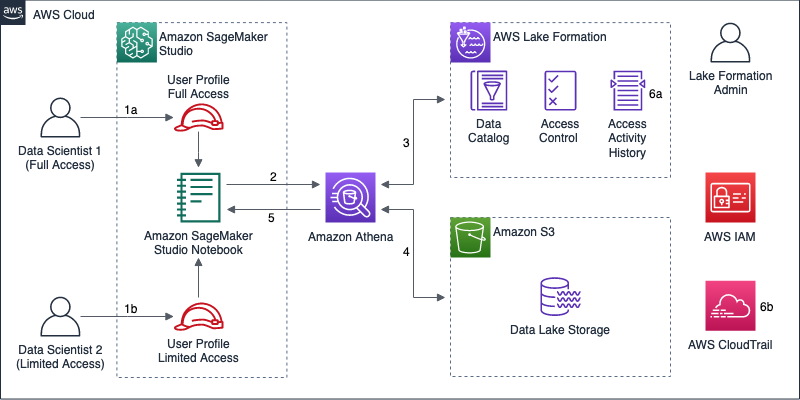

# Controlling and auditing data exploration activities with Amazon SageMaker Studio and AWS Lake Formation

Certain industries are required to audit all access to their data. This includes auditing exploratory activities performed by data scientists, who usually query data from within machine learning (ML) notebooks.

This post walks you through the steps to implement access control and auditing capabilities on a per-user basis, using [Amazon SageMaker Studio](https://docs.aws.amazon.com/sagemaker/latest/dg/studio.html) notebooks and [AWS Lake Formation](https://aws.amazon.com/lake-formation/) access control policies. This is a how-to guide based on the [Machine Learning Lens for the AWS Well-Architected Framework](https://d1.awsstatic.com/whitepapers/architecture/wellarchitected-Machine-Learning-Lens.pdf), following the design principles described in the Security Pillar:

- Restrict access to Machine Learning (ML) systems.
- Ensure data governance.
- Enforce data lineage.
- Enforce regulatory compliance.

Note: This post provides guidance for customers already using [AWS Identity and Access Management](http://aws.amazon.com/iam) (IAM) users and groups to manage identities, and also for customer using [AWS Single Sign-On](https://aws.amazon.com/single-sign-on/) (AWS SSO). Please note, however, that our [best practice for identity management](https://wa.aws.amazon.com/wat.question.SEC_2.en.html) is to use AWS SSO, or federation with AWS IAM roles, so that people access AWS accounts using temporary credentials.

## Overview of solution
This implementation uses [Amazon Athena](http://aws.amazon.com/athena) and the [PyAthena](https://pypi.org/project/PyAthena/) client on an Amazon SageMaker Studio notebook to query data on a data lake registered with AWS Lake Formation.

SageMaker Studio is the first fully integrated development environment (IDE) for ML. Amazon SageMaker Studio provides a single, web-based visual interface where you can perform all the steps required to build, train, and deploy ML models. [Studio Notebooks](https://docs.aws.amazon.com/sagemaker/latest/dg/notebooks.html) are collaborative notebooks that you can launch quickly, without setting up compute instances or file storage beforehand.

Athena is an interactive query service that makes it easy to analyze data directly in [Amazon Simple Storage Service](https://aws.amazon.com/s3/) (Amazon S3) using standard SQL. Athena is serverless, so there is no infrastructure to set up or manage, and you pay only for the queries you run.

Lake Formation is a fully managed service that makes it easier for you to build, secure, and manage data lakes. Lake Formation simplifies and automates many of the complex manual steps that are usually required to create data lakes, including securely making that data available for analytics and ML.

For an existing data lake registered with AWS Lake Formation, the following diagram illustrates the proposed implementation:

	

1. Data scientists access the [AWS Management Console](http://aws.amazon.com/console) using their identity, which can be an AWS SSO user name, a federated identity with an AWS IAM role (both options align with our [best practice](https://wa.aws.amazon.com/wat.question.SEC_2.en.html) of using temporary credentials to access AWS accounts), or an IAM user account belonging to an IAM group. In the console, data scientists open Studio using individual user profiles. Each user profile has an associated execution role, which the user assumes while working on a Studio notebook. 
The diagram depicts two data scientists that require different permissions over data in the data lake. For example, in a data lake containing personally identifiable information (PII), user Data Scientist 1 has full access to every table in the Data Catalog, whereas Data Scientist 2 has limited access to a subset of tables (or columns) containing non-PII data.
2. The Studio notebook is associated with a Python kernel. The PyAthena client allows you to run exploratory ANSI SQL queries on the data lake through Athena, using the execution role assumed by the user while working with Studio.
3. Athena sends a data access request to Lake Formation, with the user profile execution role as principal. Data permissions in Lake Formation offer database-, table-, and column-level access control, restricting access to metadata and the corresponding data stored in Amazon S3. Lake Formation generates short-term credentials to be used for data access, and informs Athena what columns the principal is allowed to access.
4. Athena uses the short-term credential provided by Lake Formation to access the data lake storage in Amazon S3, and retrieves the data matching the SQL query. Before returning the query result, Athena filters out columns that aren’t included in the data permissions informed by Lake Formation.
5. Athena returns the SQL query result to the Studio notebook.
Lake Formation records data access requests and other activity history for the registered data lake locations. [AWS CloudTrail](https://aws.amazon.com/cloudtrail/) also records these and other API calls made to AWS during the entire flow, including Athena query execution requests.

## Walkthrough

In this walkthrough, I show you how to implement access control and audit using a Studio notebook and Lake Formation. You perform the following activities:

- Register a new database in Lake Formation - `01_Register_New_Database.md`
- Create the required IAM resources - `02_Create_IAM_Roles_And_Users.md`
- Grant data permissions with AWS Lake Formation - `03_Grant_Permissions_With_Lake_Formation.md`
- Set up SageMaker Studio - `04_Set_Up_SageMaker_Studio.md`
- Test AWS Lake Formation access control policies using a Studio notebook - `05_Test_Lake_Formation_Access_Control_Policies.md`
- Audit data access activity with AWS Lake Formation and AWS CloudTrail - `06_Audit_Data_Access_With_Lake_Formation_And_CloudTrail.md`

### Prerequisites

For this walkthrough, you should have the following prerequisites:

- An [AWS account](https://signin.aws.amazon.com/signin?redirect_uri=https%3A%2F%2Fportal.aws.amazon.com%2Fbilling%2Fsignup%2Fresume&amp;client_id=signup)
- A data lake set up in Lake Formation with a Lake Formation Admin. For general guidance on how to set up Lake Formation, see [Getting started with AWS Lake Formation](https://aws.amazon.com/blogs/big-data/getting-started-with-aws-lake-formation/).
- Basic knowledge on creating IAM policies, roles, users, and groups.
- If using AWS SSO, knowledge on creating SSO permission sets and assigning them to users and groups.

If you prefer to skip the initial setup activities and jump directly to testing and auditing, you can deploy the following [AWS CloudFormation](http://aws.amazon.com/cloudformation) template in a Region that supports [Studio](https://aws.amazon.com/sagemaker/pricing/#Amazon_SageMaker_Pricing_Calculator) and [Lake Formation](https://docs.aws.amazon.com/general/latest/gr/lake-formation.html#lake-formation_region):

You can also deploy the template by [downloading the CloudFormation template](https://aws-ml-blog.s3.amazonaws.com/artifacts/sagemaker-studio-audit-control/SageMakerStudioAuditControlStack.yaml). When deploying the CloudFormation template, you provide the following parameters:

- Authentication method for Studio, which can be selected between `AWS IAM with IAM users` and `AWS IAM with AWS account federation (external IdP)`. The former option is suitable for customers using AWS IAM user and groups to manage identities. The latter is suitable for customers using AWS SSO to manage access into AWS accounts with temporary credentials, which aligns with our [best practices](https://wa.aws.amazon.com/wat.question.SEC_2.en.html) for managing identities for people.
- Studio profile name for a data scientist with full access to the dataset. The default name is `data-scientist-full`. If you select `AWS IAM with IAM users`, an IAM user with the same name is also created. In that case, the password for the IAM user is created automatically and stored as a secret in [AWS Secrets Manager](https://aws.amazon.com/secrets-manager/).
- Studio profile name for a data scientist with limited access to the dataset. The default user name is `data-scientist-limited`. If you select `AWS IAM with IAM users`, an IAM user with the same name is also created. In that case, the password for the IAM user is created automatically and stored as a secret in Secrets Manager.
- Names for the database and table to be created for the dataset. The default names are `amazon_reviews_db` and `amazon_reviews_parquet`, respectively.
- VPC and subnets that are used by Studio to communicate with the [Amazon Elastic File System](https://aws.amazon.com/efs/) (Amazon EFS) volume associated to Studio.

If you use AWS SSO, and decide to deploy the CloudFormation template, after the CloudFormation stack is complete, you must follow the sections **IAM resources for authentication using federation** and **Creating the required SSO permission set** in this post. Then you can go directly to the section **Testing Lake Formation access control policies**.

If you use AWS IAM users and groups to manage identities, and decide to deploy the CloudFormation template, after the CloudFormation stack is complete, you can go directly to the section **Testing Lake Formation access control policies** in this post.

### Where to go next?

- If you choose to deploy the CloudFormation template, after the CloudFormation stack is complete, you can go directly to [Testing AWS Lake Formation access control policies](./05_Test_Lake_Formation_Access_Control_Policies.md)
- If you prefer to perform the initial setup activities without the CloudFormation template, our you want to take a look at the activities automated by the template, you can start this walkthrough by [Registering a new Database in Lake Formation](./01_Register_New_Database.md)

## Security

See [CONTRIBUTING](CONTRIBUTING.md#security-issue-notifications) for more information.

## License

This library is licensed under the MIT-0 License. See the LICENSE file.
